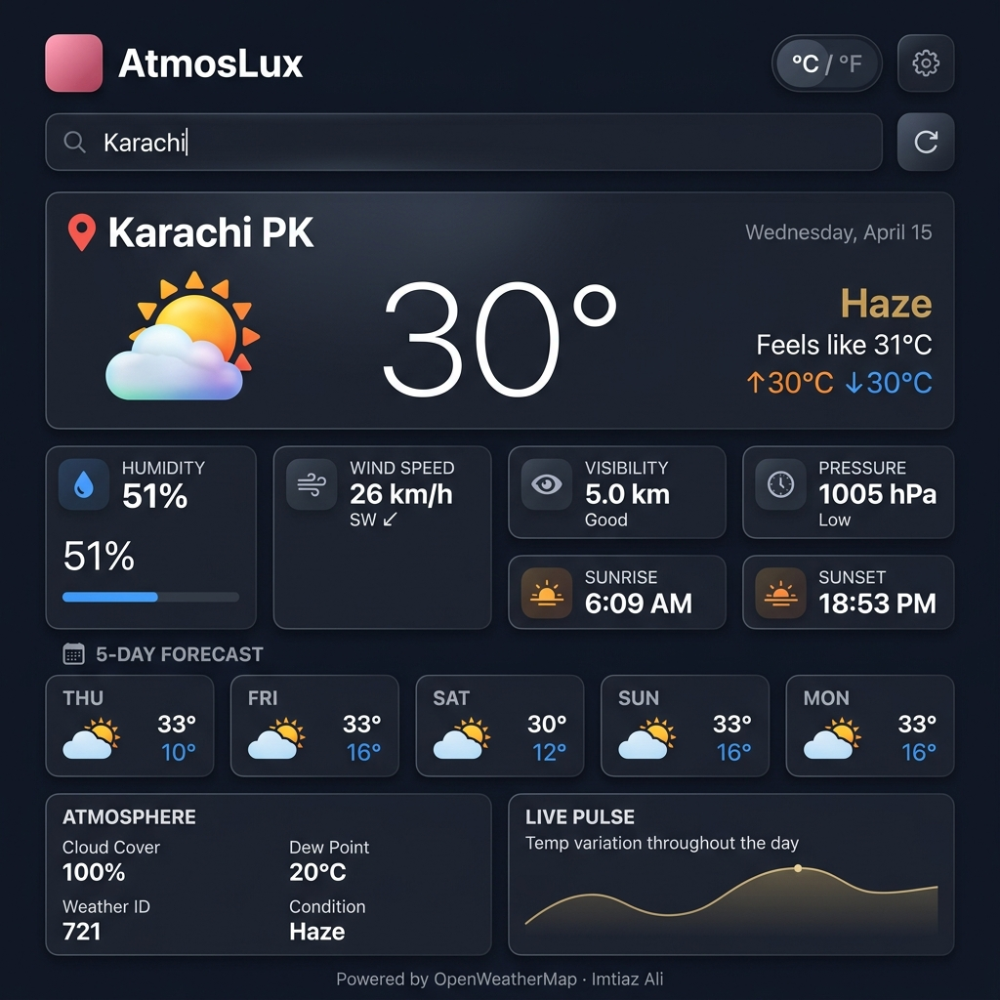

<div align="center">

  
  &nbsp;
  
  &nbsp;
  
  &nbsp;
  

  <br/><br/>

  <h1>🌤️ AtmosLux</h1>
  <p><strong>A luxurious, real-time weather experience — engineered to impress.</strong></p>
  <p><em>Search any city on Earth and get live weather intelligence wrapped in a stunning, premium interface.</em></p>

  <br/>

  

  <br/><br/>

</div>

---

## ✨ Overview

**AtmosLux** is not just another weather app — it's a professional-grade, immersive weather experience built from the ground up with a focus on **visual excellence**, **real-time data accuracy**, and **premium UX design**.

Originally a minimal card-based weather widget, it has been completely reimagined into a full-screen, feature-rich weather intelligence platform. Every pixel, every animation, and every interaction was deliberately crafted to feel polished and premium.

---

## 🖼️ App Preview

<div align="center">

| Hero Weather Card | Stats Grid | 5-Day Forecast |
|---|---|---|
| Glassmorphism hero with floating icon & glow | 6 metric cards — humidity, wind, pressure & more | Day-by-day forecast with weather icons |

</div>

> The interface **dynamically changes color themes, animations, and visual effects** based on the current weather condition — making each search feel unique.

---

## 🚀 Features

### 🌍 Core Functionality
- **Real-Time Weather** — Live data from OpenWeatherMap API for any city worldwide
- **Auto-Load** — Loads weather on startup automatically
- **GPS Geolocation** — One-click location detection with browser Geolocation API
- **Enter Key Support** — Seamlessly search without reaching for the mouse
- **Error Handling** — Friendly, animated error messages for invalid cities or network failures

### 🎨 Design & Experience
- **Full-Screen Immersive Layout** — No cramped cards; the entire viewport becomes the weather world
- **Glassmorphism UI** — `backdrop-filter: blur(20px)` applied throughout for a frosted-glass premium look
- **Aurora Background Canvas** — Animated floating blobs drawn on an HTML5 Canvas bring the background to life
- **Floating Particle System** — 20 micro-particles drift upward at randomized speeds and sizes
- **Floating Weather Icon** — The main weather icon gently bobs with a dynamic glow halo
- **Staggered Card Animations** — Each card gracefully fades and slides in on data load
- **Premium Typography** — [Outfit](https://fonts.google.com/specimen/Outfit) & [Space Grotesk](https://fonts.google.com/specimen/Space+Grotesk) via Google Fonts

### 🌦️ Dynamic Weather Themes
The entire color palette shifts based on weather condition:

| Condition | Theme |
|---|---|
| ☀️ Clear | Deep ocean blue → gold accents |
| ☁️ Clouds | Muted indigo → slate blue |
| 🌧️ Rain / Drizzle | Dark navy → cyan accents |
| ❄️ Snow | Cool slate → icy white |
| ⛈️ Thunderstorm | Deep space → vivid purple |
| 🌫️ Mist / Fog / Haze | Charcoal → soft grey |

### 🌧️ Live Weather Effects
Real atmospheric effects trigger based on weather:
- **Rain** — 60 CSS-animated rain droplets cascade across the full screen
- **Snow** — 40 unicode snowflakes ❄ drift and rotate down
- **Thunderstorm** — Purple lightning flash overlay pulses periodically

### 📊 Data Displayed
| Metric | Details |
|---|---|
| 🌡️ Temperature | Current, Feels Like, High, Low |
| 💧 Humidity | Percentage + animated progress bar |
| 💨 Wind Speed | km/h or mph + compass direction |
| 👁️ Visibility | Distance in km + quality label |
| 🔵 Pressure | Atmospheric pressure in hPa + level label |
| 🌅 Sunrise | Local sunrise time |
| 🌇 Sunset | Local sunset time |
| ☁️ Cloud Cover | Percentage from API |
| 🌿 Dew Point | Calculated from temperature + humidity |
| 🌤️ Weather ID | Official OpenWeatherMap condition ID |
| 📅 5-Day Forecast | Icon, high & low per day |
| 📈 Live Pulse Chart | Bézier temperature curve for today's hours |

### 🔄 °C / °F Live Toggle
Switch between Celsius and Fahrenheit at any time — **all values update instantly**, including:
- Main temperature, feels like, high/low
- 5-day forecast highs and lows
- Dew point
- Wind speed (km/h ↔ mph)

---

## 🛠️ Tech Stack

| Layer | Technology |
|---|---|
| **Structure** | HTML5 (Semantic) |
| **Styling** | Vanilla CSS3 (Custom Properties, Animations, Glassmorphism) |
| **Logic** | Vanilla JavaScript ES2022 (`async/await`, `strict mode`) |
| **Data** | [OpenWeatherMap API](https://openweathermap.org/api) — Current Weather + 5-Day Forecast |
| **Rendering** | HTML5 Canvas API (aurora background + temperature pulse chart) |
| **Fonts** | Google Fonts — Outfit + Space Grotesk |
| **Build Tool** | None — zero dependencies, zero frameworks |

> 💡 **No libraries. No frameworks. No build steps.** Pure, handcrafted HTML, CSS, and JavaScript.

---

## 📁 Project Structure

```
Weather-App/
├── index.html           # App shell, semantic HTML layout
├── style.css            # Full design system — themes, glassmorphism, animations
├── script.js            # Feature engine — API, state, effects, canvas
├── screenshots/
│   └── preview.png      # App preview for README
└── images/
    ├── clear.png         # Weather condition icons
    ├── clouds.png
    ├── drizzle.png
    ├── humidity.png
    ├── mist.png
    ├── rain.png
    ├── search.png
    ├── snow.png
    └── wind.png
```

---

## ⚙️ Getting Started

### Prerequisites
- A modern web browser (Chrome, Firefox, Edge, Safari)
- An OpenWeatherMap API key (free tier works perfectly)

### 1. Clone the Repository
```bash
git clone https://github.com/Imtiaz-Ali17314/AtmosLux-weather-App
cd AtmosLux-weather-App
```

### 2. Get a Free API Key
1. Sign up at [openweathermap.org](https://openweathermap.org/api)
2. Navigate to **API Keys** in your account dashboard
3. Copy your **Default** API key (or generate a new one)

### 3. Add Your API Key
Open `script.js` and replace the key on line 9:
```js
const API_KEY = "your_api_key_here";
```

### 4. Run the App
Open `index.html` directly in your browser — **or** use a local server for best results:

```bash
# Using VS Code Live Server extension (recommended)
# Right-click index.html → "Open with Live Server"

# Or using Python
python -m http.server 5500

# Or using Node.js
npx serve .
```

Then open `http://localhost:5500` in your browser.

---

## 🗺️ API Reference

This app uses two endpoints from the [OpenWeatherMap API](https://openweathermap.org/api):

### Current Weather
```
GET https://api.openweathermap.org/data/2.5/weather
  ?q={city}
  &units=metric
  &appid={API_KEY}
```

### 5-Day Forecast (3-hour intervals)
```
GET https://api.openweathermap.org/data/2.5/forecast
  ?q={city}
  &units=metric
  &appid={API_KEY}
```

> Free tier allows **60 API calls/minute** — more than enough for personal use.

---

## 🏗️ Architecture Highlights

### Dynamic Theme System
CSS custom properties (`--bg-from`, `--accent`, `--stat-bar-color`, etc.) are defined per weather condition class. JavaScript adds the appropriate class to `<body>`, and everything — gradients, glows, bars, accents — transitions automatically via CSS.

```css
body.weather-rain {
  --bg-from: #0d1b2a;
  --accent: #4fc3f7;
  --stat-bar-color: #4fc3f7;
}
```

### Aurora Canvas Animation
A continuous `requestAnimationFrame` loop renders 3 radial gradient ellipses that slowly orbit and breathe, creating a living, atmospheric background without impacting DOM performance.

### Live Pulse Chart
Temperature data from the forecast API's hourly intervals is plotted as a smooth Bézier curve on an HTML5 Canvas — complete with gradient fill, a stroke line, and dotted data points.

### Wind Unit Safety
Wind speed is stored in raw `m/s` from the API and converted at render time to either `km/h` or `mph` — ensuring the toggle is always accurate with zero data re-fetching.

---

## 📸 Screenshots

<div align="center">

### 🌫️ Haze Condition — Karachi, PK


> *Dynamic theme, humidity bar, wind compass direction, 5-day forecast, and live pulse chart all visible*

</div>

---

## 🌐 Browser Support

| Browser | Support |
|---|---|
| Chrome 90+ | ✅ Full |
| Firefox 88+ | ✅ Full |
| Edge 90+ | ✅ Full |
| Safari 14+ | ✅ Full |
| Opera 76+ | ✅ Full |

> `backdrop-filter` (glassmorphism) requires a modern browser. A `-webkit-backdrop-filter` fallback is already included in the CSS.

---

## 🔮 Potential Enhancements

Ideas for taking AtmosLux even further:

- [ ] **Hourly Forecast** — Hour-by-hour breakdown for the next 24 hours
- [ ] **Air Quality Index (AQI)** — Using OpenWeatherMap Air Pollution API
- [ ] **UV Index** — Display ultraviolet radiation level
- [ ] **Weather Maps** — Embed precipitation/cloud radar using Leaflet.js
- [ ] **Search Autocomplete** — City suggestions as you type
- [ ] **Saved Cities** — Bookmark favorite cities with localStorage
- [ ] **PWA Support** — Installable as a Progressive Web App
- [ ] **Dark/Light Mode** — Optional light theme alongside the dynamic weather themes

---

## 👨‍💻 Author

<div align="center">

**Imtiaz Ali**
*Full-Stack Developer · 29-Day Project Showcase*

[](https://www.linkedin.com/in/imtiaz-ali-79476a385/)
[](https://github.com/Imtiaz-Ali17314)


</div>

---

## 📄 License

```
MIT License

Copyright (c) 2026 Imtiaz Ali

Permission is hereby granted, free of charge, to any person obtaining a copy
of this software and associated documentation files (the "Software"), to deal
in the Software without restriction, including without limitation the rights
to use, copy, modify, merge, publish, distribute, sublicense, and/or sell
copies of the Software, and to permit persons to whom the Software is
furnished to do so, subject to the following conditions:

The above copyright notice and this permission notice shall be included in all
copies or substantial portions of the Software.

THE SOFTWARE IS PROVIDED "AS IS", WITHOUT WARRANTY OF ANY KIND, EXPRESS OR
IMPLIED, INCLUDING BUT NOT LIMITED TO THE WARRANTIES OF MERCHANTABILITY,
FITNESS FOR A PARTICULAR PURPOSE AND NONINFRINGEMENT.
```

---

<div align="center">

**⭐ If this project impressed you, give it a star!**

*Powered by [OpenWeatherMap](https://openweathermap.org) · Built with ❤️ by Imtiaz Ali*

*Day 12 of 29 — Project Showcase Journey*

</div>
